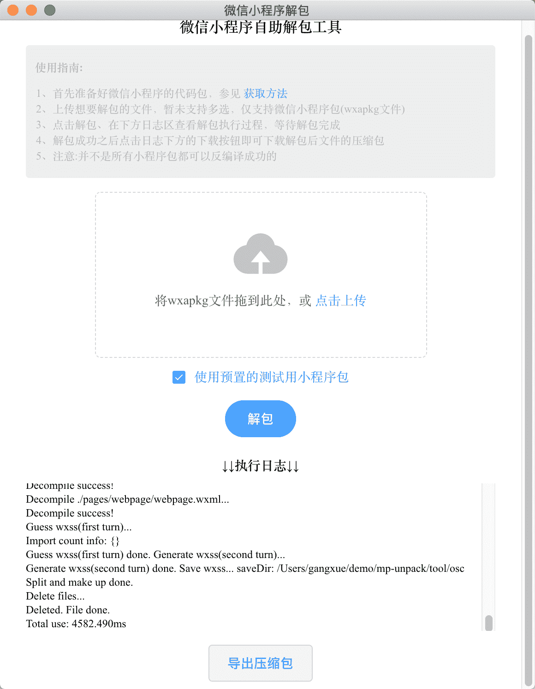
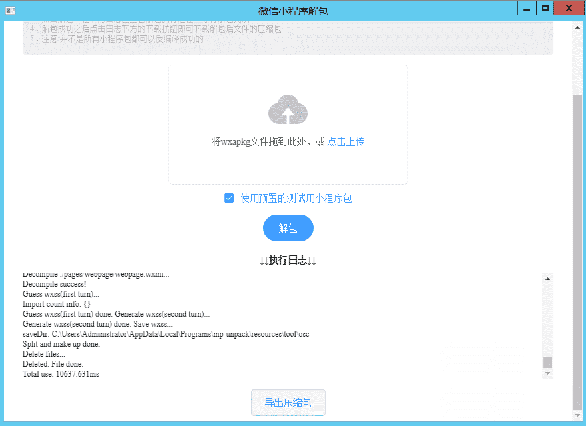

# mp-unpack

基于electron-vue开发的微信小程序自助解包客户端  
> 方便没有技术基础的同学轻松进行小程序的反编译

#### 为什么使用electron来做

上手方便、可跨平台

#### 前置准备：利用模拟器获取小程序包

参考博主的原创文章  
> [以中银E路通小程序为例10分钟带你学会微信小程序的反编译](http://xuedingmiao.com/blog/xcx_unpack.html)

#### 逆向教程小程序
  

#### 运行截图  

Mac  
  

Windows  



#### 如何使用

To clone and run this repository you'll need [Git](https://git-scm.com) and [Node.js](https://nodejs.org/en/download/) (which comes with [npm](https://www.npmjs.com/)) installed on your computer. From your command line:

``` bash
# Clone this repository
git clone https://github.com/xuedingmiaojun/mp-unpack.git
# Go into the repository
cd mp-unpack
# Install dependencies and run the app
npm install && cd tool/ && npm install 
```

To pack into an app, simply type one of these:

``` shell
npm run build
npm run build:mac
npm run build:linux
npm run build:win32
npm run build:win64
```

#### 公众号


#### [小程序逆向视频专栏](https://m.lizhiweike.com/channel2/1037814)
- 还是不知道怎么逆向？
- 遇到问题不会处理？  
快来试试作者匠心录制的视频系列课程吧~。  
[人人都能学会的微信小程序逆向技能](https://m.lizhiweike.com/channel2/1037814)

#### 逆向疑难小程序
- [逆向喜茶Go](https://www.bilibili.com/video/BV1Lv411a73w/)

#### 捐赠


#### [Download Released App](https://github.com/xuedingmiaojun/mp-unpack/releases)

#### License [GPL](LICENSE.md)

  
